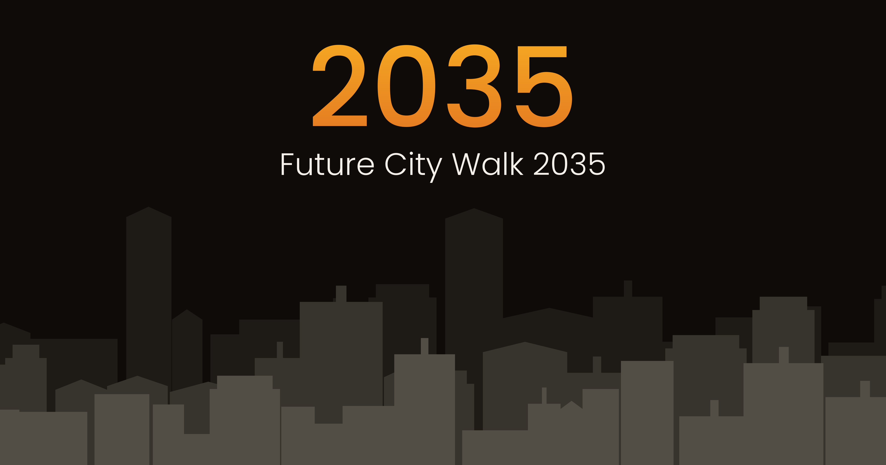

# Future City Walk 2035 – An Interactive Foresight Experience

What will your city look like in 2035?

Future City Walk 2035 is an interactive foresight experience. A 30-minute walk through four very different urban futures, each built on a fully developed scenario.

## Try It

👉 [Start Experience](https://floriandavidzeiser.github.io/future-city-walk2035-en/)

🔊 Best with sound · about 30 minutes
🌐 Needs a steady internet connection

## What It's About

Each city follows a different vision of urban life — and a different way things could play out. You follow four protagonists into their cities, make small decisions along the way, and piece together what happened. At the end, you get a personal "Foresight Profile."

A note: these four futures aren't predictions. They're thought experiments.

## Features

- Browser-based experience
- Four narrative scenarios with four protagonists
- AI-generated voices, embedded as MP3
- Micro-decisions, reconstructions, and reflections along the way
- Persistent progress, stored locally in your browser
- Personal foresight profile and shareable profile card at the end

## Information vs. Experience

> *"Scenarios aren't predictions. Summaries aren't experiences. That difference is the whole point."*

What interested me most about this project was the gap between information and experience. My thesis: foresight work that's only read doesn't land the same way as foresight work you actually walk through. Also worth noting: not everything in these futures is technically accurate or fully consistent — that wasn't the point of the experiment.

## Built with AI

After my book *AI Moment* in early 2023, various AI experiments since then, and the small arcade game *Data Center Guardian* in winter 2025, I wanted to find out how far AI tools can push narrative, intellectually rich formats.

Built with various AI tools for writing, voices, dramaturgy, and implementation. Co-creation, just like the book and the arcade game before it. And just like those earlier projects: a demanding process, despite all AI involved.

## License

Creative Commons Attribution-NonCommercial 4.0 International (CC BY-NC 4.0)

You're free to use and adapt the code for non-commercial purposes, as long as you give appropriate credit and link back to this repository.
